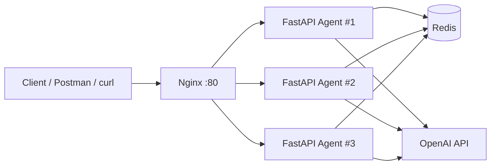

# Lab 12 - Complete Production Agent

Production-ready FastAPI AI Agent with Docker, API key auth, rate limiting, cost guard, health checks, and Render deployment.

## 1) Setup Instructions

### Requirements
- Python 3.11+
- Docker + Docker Compose

### Run Local (recommended)
```bash
# 1. Go to lab folder
cd 06-lab-complete

# 2. Create env file
cp .env.example .env.local
# Edit AGENT_API_KEY in .env.local

# 3. Start stack (agent + redis + nginx)
docker compose up --build --scale agent=3
```

### Quick Local Test
```bash
# Health
curl http://localhost/health

# Ask (with API key)
curl -X POST http://localhost/ask \
  -H "X-API-Key: dev-key-change-me-in-production" \
  -H "Content-Type: application/json" \
  -d '{"question":"What is deployment?"}'
```

## 2) API Documentation

Base URL:
- Local via Nginx: `http://localhost`
- Production: `https://ai-agent-production-5g0u.onrender.com`

### `GET /health`
- Purpose: Liveness check
- Auth: No
- Response:
```json
{"status":"ok","version":"1.0.0","environment":"production"}
```

### `GET /ready`
- Purpose: Readiness check
- Auth: No
- Response:
```json
{"ready":true}
```

### `POST /ask`
- Purpose: Ask agent a question
- Auth: Yes (`X-API-Key`)
- Headers:
  - `X-API-Key: <your-agent-api-key>`
  - `Content-Type: application/json`
- Body:
```json
{"question":"Hello, what is Docker?"}
```
- Success response:
```json
{
  "question":"Hello, what is Docker?",
  "answer":"...",
  "model":"gpt-4o-mini",
  "timestamp":"2026-04-17T00:00:00Z"
}
```
- Error codes:
  - `401`: missing/invalid API key
  - `429`: rate limit exceeded
  - `500`: internal server error

## 3) Architecture Diagram



Notes:
- Nginx load-balances requests across multiple agent instances.
- Redis stores shared state for rate limiting and reliability.
- Agent calls OpenAI model when `OPENAI_API_KEY` is configured.

## 4) Deployment Guide (Render)

This project is deployed successfully on Render using Blueprint.

### Current Production URL
- `https://ai-agent-production-5g0u.onrender.com/`

### Deploy Steps
1. Push repository to GitHub.
2. Render Dashboard -> New -> Blueprint.
3. Select branch `main`.
4. Set Blueprint Path: `06-lab-complete/render.yaml`.
5. Set secrets:
   - `OPENAI_API_KEY`
   - `AGENT_API_KEY`
6. Click Deploy and wait until service is healthy.

### Verify Production
```bash
curl https://ai-agent-production-5g0u.onrender.com/health

curl -X POST https://ai-agent-production-5g0u.onrender.com/ask \
  -H "X-API-Key: YOUR_AGENT_API_KEY" \
  -H "Content-Type: application/json" \
  -d '{"question":"Production test"}'
```

## 5) Project Structure

```text
06-lab-complete/
├── app/
│   ├── main.py
│   └── config.py
├── utils/
│   └── mock_llm.py
├── Dockerfile
├── docker-compose.yml
├── nginx.conf
├── render.yaml
├── .env.example
├── .dockerignore
└── requirements.txt
```
